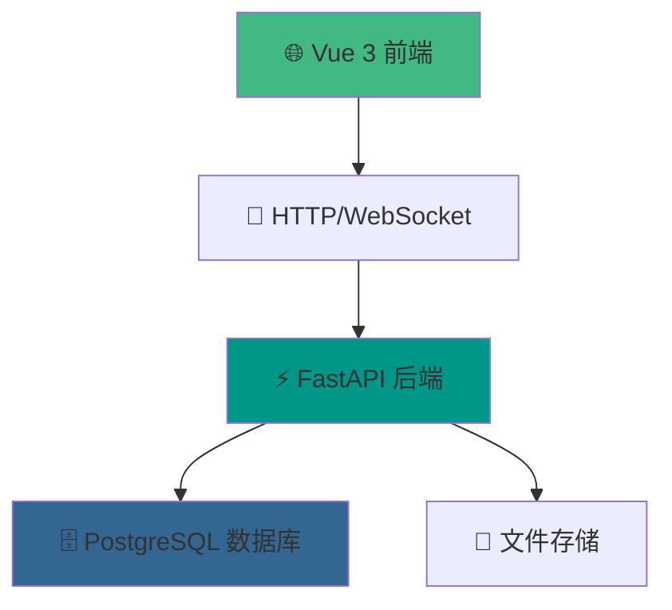

# 🏢 PrePy ERP 企业资源计划系统

<div align="center">
  
  <p><em>🚀 基于Python和Vue的现代化企业资源计划系统</em></p>
  
  
  
  
  
</div>

PrePy ERP是一个功能完整的企业资源计划系统，旨在帮助企业高效管理销售、制造、采购和库存等核心业务流程。💼

## 🏗️ 系统架构

本系统采用现代化前后端分离架构：



| 组件 | 技术栈 | 描述 |
|------|--------|------|
| 🎨 前端 | Vue 3 + Element Plus | 响应式用户界面 |
| ⚡ 后端 | FastAPI + SQLAlchemy | 高性能API服务 |
| 🗄️ 数据库 | PostgreSQL | 企业级关系数据库 |

## 🎯 主要功能模块

系统涵盖企业运营的各个核心环节：

### 📊 业务流程图


### 📋 功能详情

| 模块 | 功能特性 | 核心价值 |
|------|----------|----------|
| 💰 **销售管理** | 客户管理、报价单、销售订单、发货、发票 | 提升销售效率 |
| 📋 **计划管理** | 生产计划、物料需求计划(MRP) | 优化资源配置 |
| 🔧 **技术管理** | 产品管理、物料清单(BOM)、工艺路线 | 标准化生产 |
| 🏭 **生产管理** | 工单管理、生产跟踪、工时记录 | 提高生产效率 |
| 🛒 **采购管理** | 供应商管理、采购订单、来料检验 | 降低采购成本 |
| 📦 **仓库管理** | 库存管理、入出库、库存盘点 | 精确库存控制 |
| 💳 **财务管理** | 应收应付账款、费用管理 | 财务透明化 |
| ⚙️ **系统管理** | 用户管理、权限控制、系统配置 | 安全可控 |

## 📁 项目结构

```
prepy-erp/
├── 📄 .env                    # 环境变量配置
├── 📄 cleanpyc.py             # Python缓存清理脚本
├── 📄 logo.png                # 项目Logo
├── 📄 requirements.txt        # Python依赖
├── 📄 README.md               # 项目说明
├── 📂 backend/                # 后端服务
│   ├── 📂 models/             # 数据模型
│   ├── 📂 routers/            # API路由
│   ├── 📂 utils/              # 工具函数
│   ├── 📂 uploads/            # 文件上传目录
│   ├── 📄 main.py             # 应用入口
│   ├── 📄 config.py           # 配置文件
│   └── 📄 database.py         # 数据库连接
└── 📂 frontend/               # 前端应用
    ├── 📂 public/             # 静态资源
    ├── 📂 src/                # 源代码
    │   ├── 📂 layout/         # 布局组件
    │   ├── 📂 router/         # 路由配置
    │   ├── 📂 stores/         # 状态管理
    │   ├── 📂 utils/          # 工具函数
    │   ├── 📂 views/          # 页面组件
    │   │   ├── 📂 finance/    # 财务页面
    │   │   ├── 📂 master-data/ # 主数据页面
    │   │   ├── 📂 procurement/ # 采购页面
    │   │   ├── 📂 production/ # 生产页面
    │   │   ├── 📂 sales/      # 销售页面
    │   │   ├── 📂 system/     # 系统页面
    │   │   ├── 📂 warehouse/  # 仓库页面
    │   ├── 📄 App.vue         # 根组件
    │   ├── 📄 main.js         # 应用入口
    │   └── 📄 style.css       # 全局样式
    ├── 📄 auto-imports.d.ts   # 自动导入类型
    ├── 📄 index.html          # HTML模板
```

## 🚀 快速开始

### 📋 环境要求
- Python 3.10+
- Node.js 18+
- PostgreSQL 13+

### 🔧 安装部署

#### 1️⃣ 克隆项目
```bash
git clone https://github.com/your-username/prepy-erp.git
cd prepy-erp
```

#### 2️⃣ 后端部署
```bash
# 进入后端目录
cd backend

# 创建虚拟环境
python -m venv venv

# 激活虚拟环境 (Windows)
venv\Scripts\activate

# 激活虚拟环境 (Linux/Mac)
source venv/bin/activate

# 安装依赖
pip install -r requirements.txt

# 配置数据库连接
cp .env.example .env
# 编辑 .env 文件，配置数据库连接信息

# 启动后端服务
uvicorn main:app --reload --host 127.0.0.1 --port 8000
```

#### 3️⃣ 前端部署
```bash
# 进入前端目录
cd frontend

# 安装依赖
npm install

# 启动开发服务器
npm run dev

# 构建生产版本
npm run build
```

#### 4️⃣ 访问系统
- 🌐 前端地址：http://localhost:5173
- 🔗 后端API：http://localhost:8000
- 📚 API文档：http://localhost:8000/docs

### 👤 默认账户
- 用户名：`admin`
- 密码：`admin123`

## 🤝 贡献指南

我们欢迎所有形式的贡献！🎉

### 📝 如何贡献
1. 🍴 Fork 本项目
2. 🌿 创建特性分支 (`git checkout -b feature/AmazingFeature`)
3. 💾 提交更改 (`git commit -m 'Add some AmazingFeature'`)
4. 📤 推送到分支 (`git push origin feature/AmazingFeature`)
5. 🔄 创建 Pull Request

### 🐛 问题反馈
如果您发现任何问题，请通过 [Issues](https://github.com/your-username/prepy-erp/issues) 告诉我们。

## 📄 许可证

本项目采用 MIT 许可证 - 查看 [LICENSE](LICENSE) 文件了解详情。

---

<div align="center">
  <p>⭐ 如果这个项目对您有帮助，请给我们一个星标！</p>
  <p>Made with ❤️ by Song2770</p>
</div>
